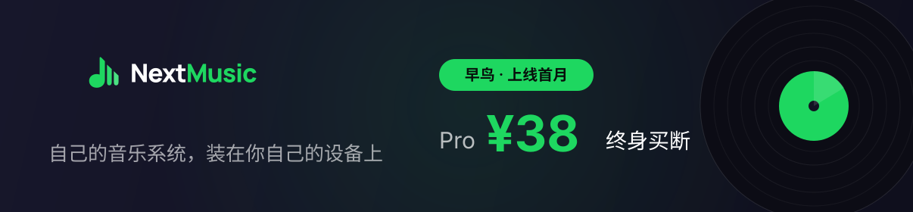
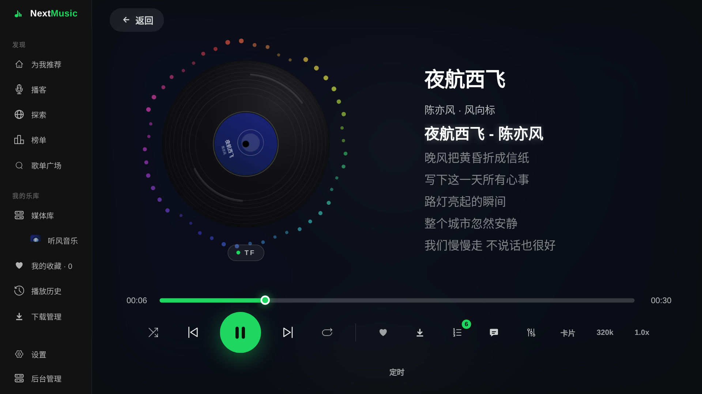
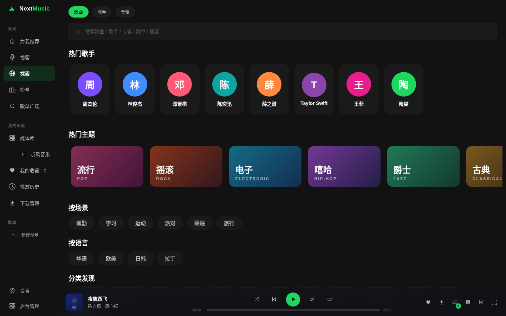
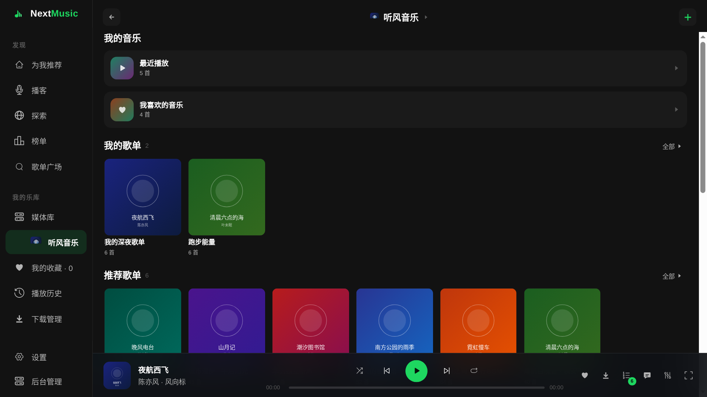
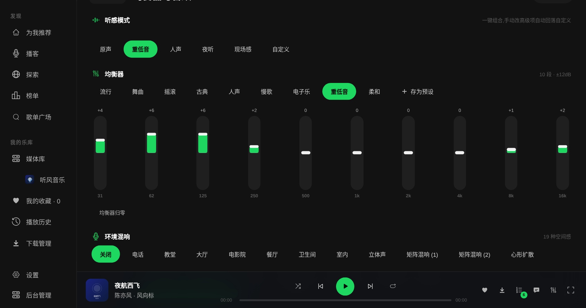
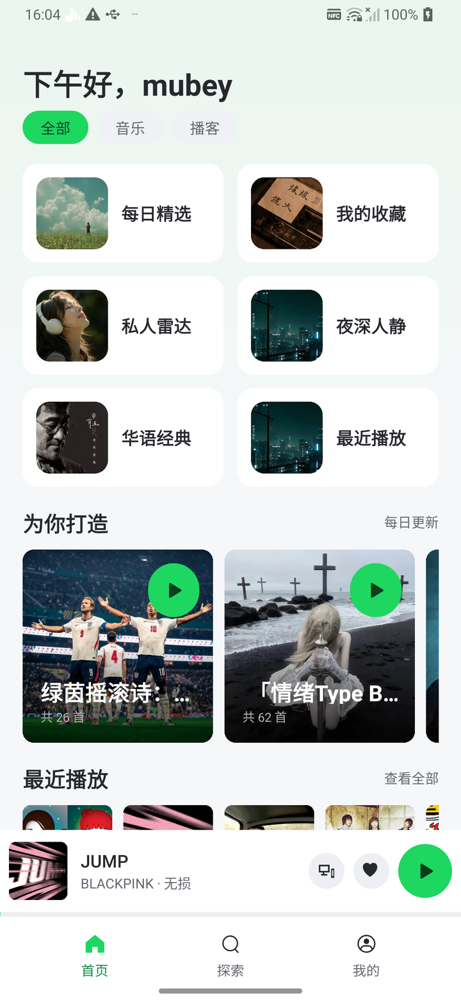
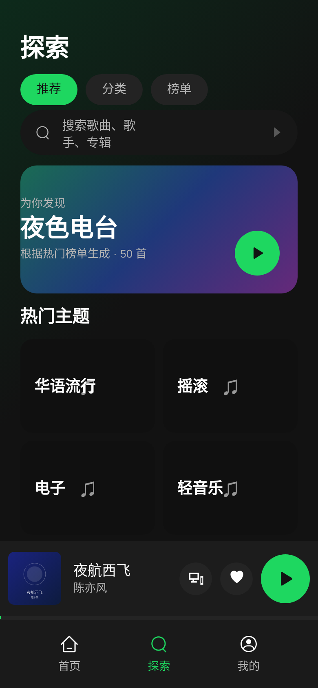

  

<h3 align="center">本地优先 · 四端一套 · 自托管同步</h3>

流媒体卖内容，别人卖客户端，<b>NextMusic 卖「自己的音乐系统」</b>——前台播放器 + 后台服务器，一套全管。

---

## ✨ 为什么是 NextMusic

- **四端一套体验** —— 手机 / TV / 桌面 / 浏览器同源界面，歌单与设置一套带走
- **无缝接续** —— 手机听一半，回家音响接着放（同一局域网免费；跨网云接续属 Pro）
- **专业音效** —— 10 段 EQ + ViPER-lite 低音/细节/响度，全链真生效
- **自托管音乐云** —— 服务器免费自建，歌缓存到自己的存储
- **告别会员** —— 本地播放 + 自定义音源 + 自己的服务器，不用再为听歌交月租
- **媒体库聚合** —— Emby / Jellyfin / Navidrome / Subsonic / WebDAV 直接挂载，家里现成的音乐资产全接进来

还有：黑胶沉浸播放页、匿名可用不强制注册、深色统一视觉。

## 📸 四块屏幕，一套体验

<table>
<tr>
<td width="474"> <b>播放的仪式感</b> · TV 黑胶播放页</td>
<td width="474"> <b>电脑上的音乐系统</b> · Web 播放器</td>
</tr>
<tr>
<td width="474"> <b>接入你的曲库</b> · HD 媒体库</td>
<td width="474"> <b>看得见的专业</b> · 10 段 EQ 音效</td>
</tr>
<tr>
<td width="210"> <b>你的音乐主页</b> · 手机</td>
<td> <b>探索好音乐</b> · 手机</td>
</tr>
</table>

## 🧰 功能一览

| 域 | 能力 |
|----|------|
| 🎵 播放与曲库 | 本地音乐 · 歌单广场/榜单 · 全局搜索 · 播放队列 · 倍速/定时关闭 · 播客（长音频聚合） · 音频可视化 |
| 🎚️ 音效 | 10 段 EQ · 流派预设 · 混响/音调/空间音效 · ViPER-lite 低音/细节/响度全链 |
| 🔄 同步与备份 | 多端歌单/收藏/音效预设云同步（免费）· WebDAV 云备份（Pro）· 断点续播/进度漫游（Pro·建设中） |
| 🖥️ 自托管服务器 | Web 管理台 · Web 播放器 · 多用户 · 服务器缓存下载 · 服务器端音源管理 |
| 📚 媒体库聚合 | 本地 · Emby · Jellyfin · Navidrome · Subsonic · WebDAV，一处浏览 |
| 🧩 更多 | 跨平台歌单导入 · 下载管理 · 主题外观 · 音频路由（蓝牙/客厅音响） · 代理设置 |

## 🏠 前台 + 后台，一套系统

**前台（播放器）**——四端同源客户端：

| 端 | 形态 |
|----|------|
| 📱 手机 / 平板 | Android App |
| 📺 TV / 盒子 / 车机 | Android HD 版（遥控器适配；Android 车机可直接安装，深度适配即将） |
| 💻 桌面 | Linux 客户端（macOS 🚧 即将提供） |
| 🌐 浏览器 | 服务器自带 Web 播放器，开网页就听 |

**后台（NextMusic Server）**——免费自托管的私有音乐云：

- **Web 管理台**：用户、服务器端音源、缓存下载，一处管完（登录认证保护）
- **Web 播放器**：全功能网页端——歌单广场 / 榜单 / 搜索 / 歌词卡片 / 队列管理，与 App 同源
- **多端同步与备份**：歌单 / 收藏 / 音效预设跨端云同步（免费），WebDAV 云备份（Pro）
- **媒体库接入**：Emby / Jellyfin / Navidrome / Subsonic 直接挂载浏览

**部署载体任选**：

- 🐳 **Docker**（NAS / 服务器 / 家庭主机）：提供 Dockerfile，`docker build` 一条命令起服务
- 💻 **桌面版内置服务器**（🚧 即将支持）：客户端 + 服务器 all-in-one，零 Docker 零 NAS，一台电脑 = 全家音乐中枢

> 🚧 **即将支持**：桌面即服务器、跨设备断点续播、逐字歌词、智能离线、主题皮肤、车机深度适配（歌单一键缓存）。

## 💚 免费 vs Pro

听、搜、播、缓存**永远不会收费**；Pro 是「更爽」，不是「能用」。服务器（含 Docker 部署、管理台、Web 播放器、缓存下载）**免费**。

| 能力 | 免费版 | Pro |
|------|--------|-----|
| 本地播放 / 音源 / 基础歌单 | ✅ 永久免费 | 同 |
| 服务器（Docker 自托管 · 管理台 · Web 播放器 · 缓存下载，部署者可控） | ✅ 免费 | 同 |
| 远程访问（自助组网 Tailscale / IPv6 / frp） | ✅ 永久免费 + 官方教程 | 同 |
| 音效 | 基础预设 + EQ 面板 + 预设云同步 | 10 段自定义 EQ + 空间音效 |
| 歌词 | 基础展示 | 逐字 + 双语 + 桌面悬浮 |
| 同步 | 局域网直连 + 歌单/收藏/音效预设云同步（服务器入口，已上线） | WebDAV 云备份 + 断点续播/进度漫游（建设中） |
| 离线 | 单曲手动 | 批量分级 + 常听预缓存 |
| 个性化 | 默认主题 | 主题全套 + 播放页自定义 |
| 家庭共享 | — | 多账号共享歌单 |

## ☕ Pro 方案 —— ¥38 终身买断

- **一次买断**：没有订阅、没有月租、没有广告（海外 $4.99 渠道筹备中）
- **7 天全功能免费试用**：App 内自动开启，无需注册；到期设置全保留
- **一码 5 台**：一枚激活码可绑定 5 台设备（手机/平板/TV/电脑都算上，够全家用）
- **只涨不降**：已解锁的 Pro 能力永久有效，不会回收
- 🛒 **购买**：[爱发电 · 请作者喝杯咖啡](https://ifdian.net/a/nextmusic) —— 付款后 24 小时内发放激活码（自动发码上线后即时到账）

## ❓ 常见问题

**Pro 是订阅吗？**
不是。¥38 一次买断终身使用，没有月租没有广告。

**试用到期会怎样？**
回到免费版：核心功能一切照旧，你的设置都还在，Pro 功能随时再开。

**我的数据安全吗？**
数据默认在你设备上：Local-first、非破坏式同步、匿名可用，不强制注册。服务器跑在你自己的 Docker / 电脑上，数据不经任何第三方云。

**用第三方音源合法吗？**
NextMusic 是播放器与自托管服务器，不提供、不分发任何受版权保护的内容。自定义音源由用户自行配置并自负其责——请遵守你所在地区的法律法规。

**和 LX Music 是什么关系？**
NextMusic 是独立开发的音乐产品：客户端为独立代码库（React Native 自研），兼容 LX Music 同步协议与自定义音源脚本。NextMusic Server 基于 Apache-2.0 开源项目 lyswhut/lx-music-sync-server 与 XCQ0607/lxserver 构建增强（遵循 Apache-2.0 保留原始版权与许可），服务器端音源聚合引擎来自 LX 开源生态，管理台与 Web 播放器为 NextMusic 全新实现。官方不提供、不分发任何音乐内容。

**没有 NAS / 服务器能用吗？**
能。手机端本地播放完整可用；桌面版即将内置服务器，一台电脑就能当家音乐中枢。

**没有公网 IP，在外面还能连回家里的服务器吗？**
能，远程访问免费，三条路任选：
- **IPv6 直连**：如果你的宽带和手机都拿到了 IPv6 地址，就能直连（服务器设置页会显示地址，复制到手机端即可）
- **Tailscale / ZeroTier 组网**：免费的组网工具，装上之后手机和家里服务器就像在同一个局域网，手机 App 里正常填地址就能连
- **自建 frp 中转**：手头有另一台带公网 IP 的机器（如轻量云）可以自建中转，进阶玩法

另外两条说明：Pro 的 **WebDAV 同步走你自己的网盘**（坚果云 / OneDrive 等），天生不依赖家里网络；不在家时，手机本地音乐、已下载缓存、手机端音源也照常能听，回家自动续上进度。

> 图文教程随部署文档一起上线。

## 📥 下载

| 平台 | 包 |
|------|-----|
| Android 手机 / 平板 | universal · arm64-v8a · armeabi-v7a · x86_64 APK |
| Android TV / 盒子 / 车机（HD 版） | 同上 |
| Linux 桌面 | deb · AppImage |
| macOS | 🚧 dmg 即将提供 |
| 服务器（后台） | 🐳 Docker（Dockerfile 自构建；服务端部署文档随后上线） |

👉 客户端前往 [**Releases**](../../releases) 获取最新版本。App 内置更新通道，保持默认即可自动收到新版本。

---

NextMusic · 免费无广告，Pro ¥38 终身 · [☕ 爱发电](https://ifdian.net/a/nextmusic)
